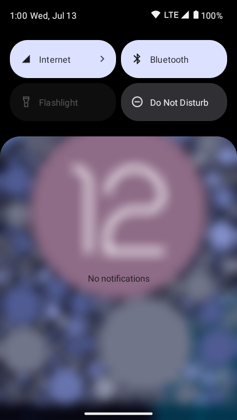

# Notification Shade Alpha (for API 31+)
"app" module makes notification area background change alpha depending on blur ability
"gui" module can set alpha value for various Notification Shade elements and maximum blur value for system from 0 to 23 (Android 12 default) to 150 (Android 11 default)

# Where did the idea come from?
I just don't like that background covers blur and i have experienced a bug on early Android 12 build where background disappears by itself, so i made a kind of remover for it. It took me 3 days.
