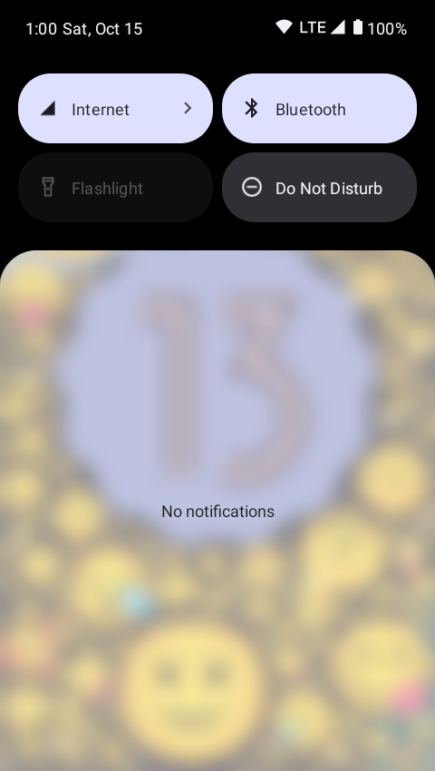

# Notification Shade Transparency
## (for API 31+)
"app" module makes notification shade scrims transparent like in Android 11  
"gui" module is disabled by default because of bugs. Can change transparency of scrims through the GUI  

